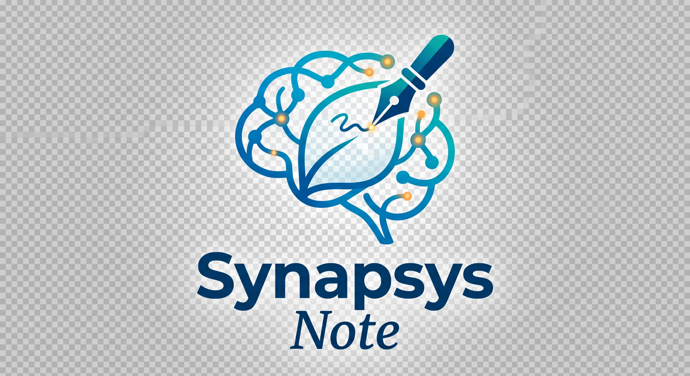

<div align="center">
  
  <p><strong>Conhecimento que se conecta.</strong></p>
</div>

Plataforma de produtividade e gestão de conhecimento (PKM) que combina a
flexibilidade de blocos e bases de dados do Notion com a velocidade de captura,
OCR e áudio do Evernote — com **backend 100% Firebase** e um **módulo nativo de
conexão e importação do Notion** (arquivos, páginas aninhadas e bases de dados).

---

## Índice

1. [O que já funciona](#o-que-já-funciona)
2. [Rodando em 30 segundos](#rodando-em-30-segundos)
3. [Arquitetura](#arquitetura)
4. [Documentação por etapa](#documentação-por-etapa)
5. [Estrutura de pastas](#estrutura-de-pastas)
6. [Setup completo (Firebase + Notion + IA)](#setup-completo)
7. [Deploy](#deploy)
8. [Decisões de projeto](#decisões-de-projeto)

---

## O que já funciona

| Área | Entregue |
| --- | --- |
| **Editor de blocos** | TipTap com slash commands (`/`), bubble menu, drag handles laterais, menções (`@`) com backlinks bidirecionais, callouts, toggles, código com realce, equações KaTeX, mídia embutida |
| **Importação do Notion** | OAuth 2.0, árvore hierárquica selecionável, conversor recursivo de blocos, mapeamento de propriedades de bases de dados, rehospedagem de arquivos no Cloud Storage, worker em background com progresso em tempo real |
| **Bases de dados** | Visualizações Tabela e Kanban sobre os mesmos dados, edição inline, drag-and-drop de status |
| **Captura (Evernote-like)** | Gravação de voz com transcrição e resumo via Gemini, OCR automático de imagens e PDFs via Cloud Vision |
| **Busca** | Command Palette (`Cmd/Ctrl+K`) com busca híbrida: full-text local (funciona offline, inclui OCR e transcrições) + vetores via `findNearest` no Firestore |
| **Organização** | Cadernos, árvore infinita de páginas, tags globais, favoritos, histórico de versões, lixeira com retenção de 30 dias |
| **Infra** | Regras de segurança de Firestore e Storage, índices compostos e vetoriais, 12 Cloud Functions, persistência offline nativa |

### Modo demonstração local

**O app roda sem nenhuma credencial.** Se as variáveis `NEXT_PUBLIC_FIREBASE_*`
não estiverem definidas, a camada de dados troca o adaptador do Firestore por um
adaptador local (localStorage) que implementa exatamente o mesmo contrato
reativo — inclusive um worker simulado de importação do Notion, OCR e
transcrição. Isso existe para que o fluxo completo possa ser avaliado antes de
provisionar qualquer serviço; nenhum componente de UI sabe qual adaptador está
ativo.

---

## Rodando em 30 segundos

```bash
npm install
npm run dev          # http://localhost:43127
```

Na tela inicial, clique em **“Explorar demonstração local (sem cadastro)”**.

Para usar o backend real, copie `.env.example` para `.env.local` e preencha
(veja [Setup completo](#setup-completo)).

---

## Arquitetura

```
┌──────────────────────────── Navegador ─────────────────────────────┐
│  Next.js App Router (RSC + Client Components)                      │
│    Editor TipTap · Import Wizard · Command Palette · Kanban        │
│                              │                                     │
│                     DataAdapter (interface)                        │
│              ┌───────────────┴───────────────┐                     │
│      FirestoreAdapter                  LocalAdapter                │
│      (onSnapshot + cache offline)      (localStorage, demo)        │
└──────────────┬─────────────────────────────────────────────────────┘
               │ SDK Web (tempo real, offline-first)
┌──────────────▼─────────────────────────────────────────────────────┐
│  Firebase                                                          │
│    Auth (Google, e-mail/senha)                                     │
│    Firestore  /workspaces/{id}/{pages,databases,import_jobs,...}   │
│    Storage    workspaces/{id}/{uploads,notion,audio}/…             │
│    Functions  ── Notion pipeline ─ Vision OCR ─ Gemini ─ vetores   │
└──────────────┬─────────────────────────────────────────────────────┘
               │ tokens descriptografados só no servidor
        ┌──────▼───────┐   ┌─────────────┐   ┌──────────────────────┐
        │  Notion API  │   │ Cloud Vision│   │ Gemini / embeddings  │
        └──────────────┘   └─────────────┘   └──────────────────────┘
```

Regra central: **o navegador nunca vê um token de terceiro.** O callback OAuth
roda no servidor Next.js, criptografa o token com AES-256-GCM e grava em uma
subcoleção que as regras negam para qualquer cliente. Só as Cloud Functions
descriptografam.

---

## Documentação por etapa

O roteiro pedido está detalhado em `docs/`:

| Etapa | Documento | Conteúdo |
| --- | --- | --- |
| 1 | [`docs/01-modelo-de-dados.md`](docs/01-modelo-de-dados.md) | Modelagem NoSQL completa, `firestore.rules`, `storage.rules`, índices |
| 2 | [`docs/02-arquitetura.md`](docs/02-arquitetura.md) | Árvore de arquivos, SDKs, camada de dados, hooks customizados |
| 3 | [`docs/03-importacao-notion.md`](docs/03-importacao-notion.md) | OAuth, conversor recursivo, pipeline de mídia, worker de progresso |
| 4 | [`docs/04-midia-ocr-ia.md`](docs/04-midia-ocr-ia.md) | Cloud Vision, Gemini, embeddings e busca semântica |
| 5 | [`docs/05-editor.md`](docs/05-editor.md) | Extensões do TipTap, serialização e autosave |
| 6 | [`docs/06-componentes-ui.md`](docs/06-componentes-ui.md) | Design system, wizard, sidebar, palette, tabela e kanban |
| 7 | [`docs/07-setup-e-deploy.md`](docs/07-setup-e-deploy.md) | Passo a passo de configuração e deploy |

---

## Estrutura de pastas

```
.
├── firebase.json                # rules, indexes, functions, emuladores
├── firestore.rules              # ETAPA 1 — autorização por membro/role
├── firestore.indexes.json       # índices compostos + índice vetorial (768d)
├── storage.rules                # ETAPA 1 — uploads, áudio, mídia do Notion
├── .env.example
├── docs/                        # roteiro técnico (etapas 1 a 7)
├── functions/                   # Cloud Functions (Node 20 + TypeScript)
│   └── src/
│       ├── index.ts             # exportação e opções globais
│       ├── lib/{firebase,crypto}.ts
│       ├── notion/
│       │   ├── client.ts        # cliente autenticado + throttle/retry
│       │   ├── tree.ts          # search → árvore hierárquica
│       │   ├── block-converter.ts   # notionBlockToAppBlock (recursivo)
│       │   ├── property-mapper.ts   # schema e valores de bases de dados
│       │   ├── media-pipeline.ts    # download por stream → Cloud Storage
│       │   └── import-job.ts        # processNotionImportJob + callables
│       ├── ai/{ocr,transcribe,embeddings}.ts
│       └── maintenance/trash.ts # retenção de 30 dias
└── src/
    ├── app/
    │   ├── layout.tsx           # fontes, tema, providers, toaster
    │   ├── page.tsx             # landing + autenticação
    │   ├── api/notion/{authorize,callback}/route.ts
    │   └── app/                 # workspace autenticado
    │       ├── layout.tsx       # AppShell
    │       ├── page.tsx         # início
    │       ├── p/[pageId]/      # editor
    │       ├── db/[databaseId]/ # tabela + kanban
    │       ├── tag/[tag]/
    │       ├── trash/
    │       └── integrations/
    ├── components/
    │   ├── editor/              # TipTap: extensões, bubble menu, serializer
    │   ├── notion/import-wizard.tsx
    │   ├── database/            # tabela, kanban, células
    │   ├── layout/              # shell, sidebar, command palette
    │   ├── media/audio-recorder.tsx
    │   ├── page/page-view.tsx
    │   └── ui/                  # primitivas (Radix + Tailwind)
    ├── hooks/
    │   ├── use-auth.tsx
    │   ├── use-firestore-live-doc.ts
    │   ├── use-debounce-auto-save.ts
    │   └── use-notion-import.ts
    ├── lib/
    │   ├── firebase/{client,admin}.ts
    │   ├── data/{adapter,firestore-adapter,local-adapter,provider,seed}.ts
    │   ├── crypto/token-cipher.ts
    │   ├── notion/mock-workspace.ts
    │   └── search.ts
    └── types/models.ts
```

---

## Setup completo

### 1. Firebase

```bash
npm install -g firebase-tools
firebase login
firebase use --add            # selecione seu projeto
```

No console do Firebase:

- **Authentication** → habilite *Google* e *E-mail/senha*.
- **Firestore** → crie o banco em modo produção.
- **Storage** → crie o bucket padrão.
- **Configurações → Seus apps → Web** → copie as chaves para `.env.local`.
- **Configurações → Contas de serviço** → gere a chave privada e cole o JSON
  inteiro (uma linha) em `FIREBASE_SERVICE_ACCOUNT_JSON`.

Publique regras e índices:

```bash
npm run deploy:rules
```

### 2. Notion

1. Acesse <https://www.notion.so/my-integrations> → **New integration**.
2. Tipo **Public integration** (necessário para OAuth).
3. Redirect URI: `http://localhost:43127/api/notion/callback` (e a URL de
   produção equivalente).
4. Capabilities: *Read content* (e *Read user information* se quiser exibir o
   autor).
5. Copie **OAuth client ID** e **OAuth client secret** para `.env.local`.

Gere a chave de criptografia dos tokens:

```bash
openssl rand -base64 32     # cole em TOKEN_ENCRYPTION_KEY
```

### 3. IA e Cloud Functions

```bash
cd functions && npm install && cd ..

firebase functions:secrets:set TOKEN_ENCRYPTION_KEY   # mesmo valor do .env.local
firebase functions:secrets:set GEMINI_API_KEY         # https://aistudio.google.com/apikey

gcloud services enable vision.googleapis.com          # OCR
```

Para busca semântica, crie o índice vetorial (o `firestore.indexes.json` já o
declara; em projetos existentes pode ser necessário rodar):

```bash
gcloud firestore indexes composite create \
  --collection-group=pages --query-scope=COLLECTION \
  --field-config=field-path=deletedAt,order=ascending \
  --field-config=field-path=embedding,vector-config='{"dimension":768,"flat":{}}'
```

### 4. Emuladores (opcional, recomendado no dia a dia)

```bash
npm run emulators
NEXT_PUBLIC_USE_FIREBASE_EMULATORS=true npm run dev
```

---

## Deploy

**Frontend (Vercel):** conecte o repositório, defina as mesmas variáveis do
`.env.local` no painel e atualize `NOTION_REDIRECT_URI` para o domínio de
produção — o valor precisa ser idêntico ao cadastrado no Notion.

**Backend:**

```bash
npm run deploy:rules        # firestore.rules + índices + storage.rules
npm run deploy:functions    # 12 Cloud Functions
```

Verificação pós-deploy:

```bash
firebase functions:log --only processNotionImportJob
```

---

## Decisões de projeto

**Por que uma interface `DataAdapter` em vez de chamar o Firestore direto nos
componentes.** O mesmo contrato serve à produção (onSnapshot, cache offline) e à
demonstração sem credenciais. Como consequência, nenhuma tela precisa de código
condicional, e trocar o backend um dia é reescrever um arquivo.

**Por que rehospedar as mídias do Notion.** A API do Notion devolve URLs
presigned do S3 que expiram em cerca de uma hora. Guardá-las significaria uma
base inteira de imagens quebradas no dia seguinte. A Cloud Function baixa cada
arquivo por streaming — memória constante mesmo em vídeos de centenas de MB — e
reescreve o bloco com o link permanente do Cloud Storage.

**Por que o worker é acionado por um documento e não por HTTP.** Importar
milhares de páginas não cabe no tempo limite de uma requisição. O cliente cria
`/workspaces/{id}/import_jobs/{jobId}` e volta imediatamente; o gatilho do
Firestore roda por até 60 minutos e atualiza o mesmo documento a cada item, que é
exatamente o que o listener do wizard renderiza. Fechar o modal não cancela nada.

**Por que `extractedOCRText`, `transcriptText` e `embedding` são campos
server-only.** As regras rejeitam qualquer escrita do cliente nesses campos. Eles
alimentam a busca; se fossem graváveis pelo navegador, um cliente comprometido
poderia envenenar o índice de todo o workspace.

**Por que o formato de bloco é próprio, e não o JSON do TipTap.** `AppBlock[]` é
o alvo da conversão do Notion, a fonte do texto indexado e o que o editor
serializa. Manter o formato de armazenamento independente do schema do editor
permite trocar de editor sem migrar dados — e permite que a Cloud Function
produza conteúdo sem instanciar um ProseMirror.
